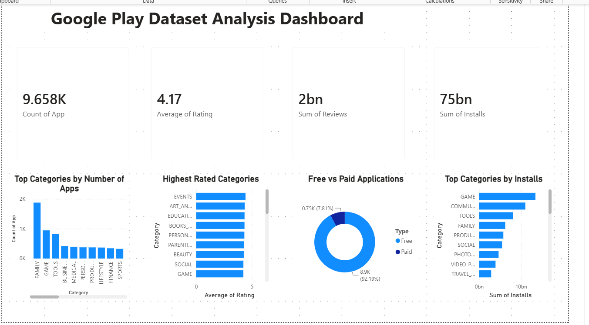
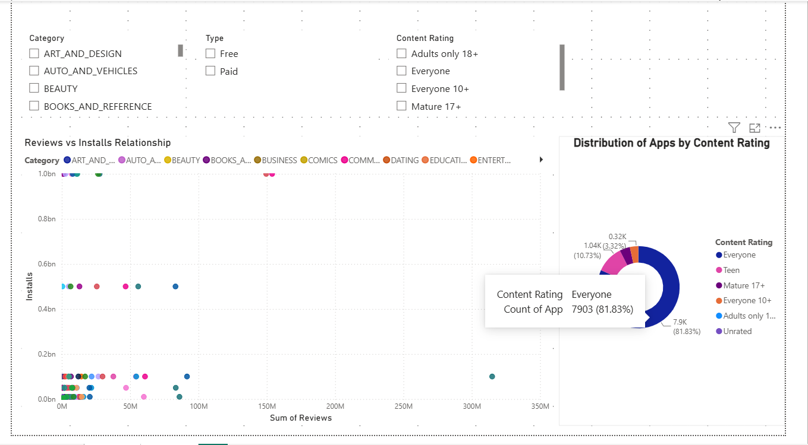

# 📱 Google Play Store Analytics Dashboard

## 🎯 Project Overview

Every day, millions of users download applications from the Google Play Store. But what makes an app successful?

In this project, I analyzed Google Play Store application data to understand trends in app ratings, installs, categories, pricing models, and user engagement.

The project follows a complete data analytics workflow:

📥 Data Collection → 🧹 Data Cleaning → 📊 Exploratory Data Analysis → 📈 Power BI Dashboard → 💡 Insights

---

# 🛠️ Tools Used

* Python
* Pandas
* NumPy
* Matplotlib
* Seaborn
* Power BI
* Jupyter Notebook

---

# 📂 Dataset

The dataset contains information about Google Play Store applications, including:

* App Name
* Category
* Rating
* Reviews
* Installs
* Price
* Content Rating
* Android Version
* Last Updated Date

---

# 🧹 Data Cleaning

Before analysis, the dataset was cleaned and prepared using Python.

### Cleaning Steps Performed

✅ Removed duplicate records

✅ Removed duplicate applications while keeping the version with the highest number of reviews

✅ Handled missing values

✅ Converted columns to appropriate data types

✅ Processed date-related features

✅ Created a clean dataset with **9,658 applications and 16 features**

---

# 📊 Exploratory Data Analysis (EDA)

The goal of EDA was to explore patterns, trends, and relationships within the dataset.

### Questions Explored

📌 How are app ratings distributed?

📌 Which categories contain the most applications?

📌 Which categories have the highest average ratings?

📌 What is the proportion of Free vs Paid applications?

📌 Which categories generate the highest installs?

📌 Is there a relationship between reviews and installs?

📌 How are numerical features correlated?

### Visualizations Used

* Histograms
* Bar Charts
* Treemap
* Pie / Donut Charts
* Boxplots
* Scatter Plots
* Correlation Heatmap

---

# 📈 Power BI Dashboard

An interactive Power BI dashboard was created to summarize key findings.

### Dashboard KPIs

📱 Total Applications: **9,658**

⭐ Average Rating: **4.17**

📝 Total Reviews: **2+ Billion**

⬇️ Total Installs: **75+ Billion**

### Dashboard Visuals

📊 Top Categories by Number of Apps

⭐ Highest Rated Categories

💰 Free vs Paid Applications

📈 Top Categories by Installs

🔍 Reviews vs Installs Relationship

👥 Content Rating Distribution

🎛️ Interactive Filters and Slicers

---

# 💡 Key Insights

### 📱 Category Insights

* FAMILY contains the highest number of applications.
* GAME attracts the largest number of installs.

### ⭐ Rating Insights

* Most applications have ratings above 4.0.
* Average app rating is 4.17, indicating generally positive user satisfaction.

### 💰 Pricing Insights

* More than 92% of applications are free.
* Paid applications represent a small portion of the Play Store ecosystem.

### 📈 User Engagement Insights

* Applications with higher review counts generally tend to achieve higher installs.
* Reviews can act as a strong indicator of app popularity.

---

# 🚀 Project Workflow

```text
Raw Dataset
    ↓
Data Cleaning (Python)
    ↓
Exploratory Data Analysis (Python)
    ↓
Power BI Dashboard
    ↓
Business Insights
```

---

## 📷 Dashboard Preview

### ### Dashboard Page 1



### ### Dashboard Page 2


# 👩‍💻 Author

**Manvi Soni**

Aspiring Data Analyst | Python | SQL | Power BI | Data Visualization

Always learning, building, and exploring data-driven solutions.
